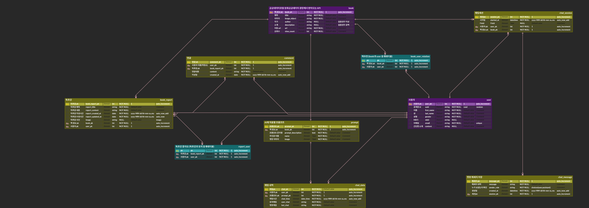

<h1 align="center">Welcome to dongwhanara 👋</h1>
<p>
  
</p>

> 여러가지 동화를 통해 동화 속 주인공과 대화가 가능한 챗봇 서비스를 메인으로 도서에 대해 독후감 작성 가능 및 MBTI 기반으로 동화 추천 기능을 제공.

## Install

### 필수 조건

- Python 3.8 이상
- pip 23.0 이상
- Git 2.25 이상
```sh
git clone https://github.com/your-repository.git
cd project-directory
python -m venv venv
source venv/bin/activate
pip install -r requirements.txt
python manage.py migrate
python manage.py loaddata books.json
python manage.py runserver
```

## 핵심 기능

### AI 추천 엔진

Sentence-Transformers와 코사인 유사도 측정을 이용하였습니다.

- 각각 MBTI 성격을 매핑하고 도서의 제목과 간단한 설명을 임베딩 벡터를 생성 후 코사인 유사도 기반으로 매칭을 수행합니다.

- 상위항목만 따로 추려내어 DB에 저장하고 요청이 들어올때 DB에서 상위항목을 JSON으로 변환 후 보내는 방식입니다. 

<details markdown="1">
<summary>자세한 로직</summary>
<pre><code class="language-python">
def get_document_simular():

    # lazy import

    from sentence_transformers import SentenceTransformer
    from sklearn.metrics.pairwise import cosine_similarity

    # 문장 임베딩 모델
    model = SentenceTransformer('all-MiniLM-L6-v2')

    # MBTI 성격을 예시로 만들고 딕셔너리 형태로 저장
    mbti_profiles = {
        'INTJ': '독립적이고 계획적인 전략가, 목표 지향적',
        'INTP': '호기심 많고 창의적인 아이디어 뱅크',
        'ENTJ': '리더십 강하고 추진력 있는 관리자',
        'ENTP': '토론 즐기고 유연하게 문제 해결하는 혁신가',
        'INFJ': '깊이 있는 통찰력과 가치 중심의 이상주의자',
        'INFP': '감성적이고 개성 강한 조용한 이상주의자',
        'ENFJ': '타인을 이끄는 따뜻한 리더',
        'ENFP': '자유로운 영혼의 열정적인 사람 중심주의자',
        'ISTJ': '신뢰받는 책임감 강한 관리자',
        'ISFJ': '헌신적이고 배려 깊은 조용한 조력자',
        'ESTJ': '조직적이고 체계적인 현실주의 리더',
        'ESFJ': '사교적이며 조화를 중시하는 현실적 배려자',
        'ISTP': '분석적이고 유연한 문제 해결자',
        'ISFP': '예술적 감성의 조용한 자유인',
        'ESTP': '현실적이고 에너지 넘치는 행동가',
        'ESFP': '사교적이며 즉흥적인 분위기 메이커',
    }
    
    #책의 제목과 설명을 가져옴.
    books = list(Book.objects.all().values('title', 'description'))
    #list comprehension
    book_descriptions = [book['description'] for book in books]
    #책의 설명을 벡터화
    book_vectors = model.encode(book_descriptions)

    mbti_recommendations = {}

    for mbti, profile_text in mbti_profiles.items():
    
        mbti_vector = model.encode([profile_text])
        similarities = cosine_similarity(mbti_vector, book_vectors)[0]

        top_books = sorted(zip(books, similarities), key=lambda x: x[1], reverse=True)[:5]  # 상위 5권 추천
        mbti_recommendations[mbti] = [
            {"title": b['title'], "score": round(score, 3)} for b, score in top_books
        ]

    return mbti_recommendations
</details>

## 기술 스택

**백엔드 프레임워크**: Django 4.2.21, Django REST Framework 3.16.0
**AI/ML 라이브러리**: Sentence-Transformers 4.1.0
**데이터베이스**: SQLite3
**API 문서화**: DRF Spectacular 0.28.0
**인증 시스템**: JWT, Django AllAuth 65.8.1

## 환경 변수 설정

`.env` 파일에 다음 변수들을 반드시 설정해야 합니다:

```env
OPENAI_API_KEY=OPENAI에서 발급받은 API KEY
SERVICE_KEY=문화공공데이터광장에서 발급받은 API KEY
```

## 프로젝트 디렉토리 구조

```
be_pjt/
├── manage.py
├── requirements.txt
├── .env
|
├── accounts/
│   ├── views.py
│   ├── serializers.py
│   └── models.py
|   └── paginations.py
|
├── books/
│   ├── views.py
│   ├── serializers.py
│   └── models.py
|   └── utils.py
|   └── paginations.py
|
├── chats/
│   ├── views.py
│   ├── serializers.py
│   └── models.py
|   └── utils.py
|
└── be_pjt/
    ├── settings.py
    ├── urls.py
    
```
<details>
<summary>API 명세서</summary>

# 📚 Dongwha Book API 명세서

> 이 문서는 OpenAPI 3.0 스키마(`schema.yaml`)를 기반으로 작성되었습니다.  
> 모든 API는 JWT 인증(httpOnly: `dongwha-auth`)을 사용합니다.  
> 요청/응답 예시는 실제 스키마를 참고하여 작성되었습니다.

---

## 🔖 목차

- [공통 안내](#공통-안내)
- [인증 및 회원](#인증-및-회원)
  - [로그인](#로그인)
  - [로그아웃](#로그아웃)
  - [내 정보 조회/수정](#내-정보-조회수정)
  - [비밀번호 변경/재설정](#비밀번호-변경재설정)
  - [회원가입 및 이메일 인증](#회원가입-및-이메일-인증)
  - [토큰 갱신/검증](#토큰-갱신검증)
- [도서](#도서)
  - [도서 목록/상세/검색/추천](#도서-목록상세검색추천)
- [독후감](#독후감)
  - [독후감 작성/조회/수정/삭제](#독후감-작성조회수정삭제)
  - [독후감 좋아요](#독후감-좋아요)
- [댓글](#댓글)
- [챗봇](#챗봇)
- [공통 응답/에러](#공통-응답에러)
- [스키마 예시](#스키마-예시)

---

## 📌 공통 안내

- **Base URL**: `/`
- **인증**: JWT (쿠키)
- **모든 요청/응답은 JSON 포맷**  
- **페이지네이션**: 리스트 API는 `page` 파라미터 사용

---

## 🛡️ 인증 및 회원

### 로그인

- **POST** `/accounts/login/`
- **설명**: 사용자 인증 후 JWT 토큰 반환

#### 요청 예시
```json

{
"username": "user1",
"password": "password"
}

```

#### 응답 예시
```json

{
"access": "<access_token>",
"refresh": "<refresh_token>",
"user": {
"pk": 1,
"username": "user1",
"email": "user1@example.com"
        }
}

```

---

### 로그아웃

- **POST** `/accounts/logout/`
- **설명**: 현재 유저의 토큰 삭제 및 로그아웃 처리
- **인증 필요**: O

#### 응답 예시
```json

{
"detail": "Successfully logged out."
}

```

---

### 내 정보 조회/수정

- **GET / PUT / PATCH** `/accounts/my-page/`
- **설명**: 유저 정보 조회 및 수정

#### 응답 예시
```json

{
"pk": 1,
"username": "user1",
"email": "user1@example.com",
"first_name": "길동",
"last_name": "홍",
"gender": "male",
"mbti": "INTJ",
"content": "자기소개",
"recommend_books": [],
"written_reports": []
}

```

#### 수정 요청 예시
```json

{
"first_name": "길동",
"last_name": "홍",
"gender": "male",
"mbti": "INTJ",
"content": "자기소개"
}

```

---

### 비밀번호 변경/재설정

#### 비밀번호 변경

- **POST** `/accounts/password/change/`
- **설명**: 새 비밀번호로 변경

```json

{
"new_password1": "newpass",
"new_password2": "newpass"
}

```

#### 비밀번호 재설정(이메일 요청)

- **POST** `/accounts/password/reset/`

```json

{
"email": "user1@example.com"
}

```

#### 비밀번호 재설정(토큰 인증)

- **POST** `/accounts/password/reset/confirm/`

```json

{
"uid": "<uid>",
"token": "<token>",
"new_password1": "newpass",
"new_password2": "newpass"
}

```

---

### 회원가입 및 이메일 인증

#### 회원가입

- **POST** `/accounts/registration/`

```json

{
"username": "user2",
"email": "user2@example.com",
"password1": "password",
"password2": "password",
"first_name": "길동",
"last_name": "홍",
"gender": "male",
"mbti": "INTJ",
"content": "소개글"
}

```

#### 이메일 인증 재전송

- **POST** `/accounts/registration/resend-email/`

```json

{
"email": "user2@example.com"
}

```

#### 이메일 인증 확인

- **POST** `/accounts/registration/verify-email/`

```json

{
"key": "<인증키>"
}

```

---

### 토큰 갱신/검증

#### 토큰 갱신

- **POST** `/accounts/token/refresh/`

```json

{
"refresh": "<refresh_token>"
}

```

#### 토큰 검증

- **POST** `/accounts/token/verify/`

```json

{
"token": "<access_token>"
}

```

---

## 📚 도서

### 도서 목록/상세/검색/추천

#### 도서 목록

- **GET** `/api/v1/books/?page={page}`  
- **설명**: 저장된 책 리스트 반환 (페이지당 50개)

#### 응답 예시
```json

{
    "count": 343,
    "current_page": 1,
    "next_page": 2,
    "previous_page": null,
    "result": [
        {
            "id": 1,
            "title": "코끼리 놀이터",
            "image_object": "https://www.nlcy.go.kr/multiLanguageStory/2024/Nlcy_002_002/Nlcy_002_002.png",
            "author": "글:서석영||그림:주리",
            "description": "귀엽고 해맑은 병아리들이 산책을 나왔다가, 바위 놀이터에 올라가 즐겁게 놀고 있어요. 그런데, 알고 보니 이 바위의 정체는…? 《코끼리 놀이터》는 병아리들을 위해 묵묵히 참고 기다려준 코끼리의 마음이 따뜻하게 전해지는 그림책이랍니다.",
            "url": "https://www.nlcy.go.kr/NLCY/contents/C10503010000.do?schFld=ko&cmd=all&langCodeType=ko&schM=view&storySeq=364",
            "view_count": 3683,
            "recommend_users": []
        },
      .
      .
      .
    ]
}

```

---

#### 도서 상세

- **GET** `/api/v1/books/{book_pk}/`

#### 응답 예시
```json

{
    "id": 1,
    "book_reports": [
        {
            "id": 1,
            "user": {
                "last_name": "",
                "first_name": "",
                "username": "admin"
            },
            "report_title": "test",
            "report_content": "1",
            "report_created_at": "2025-05-26T15:17:10.115210Z",
            "report_updated_at": "2025-05-26T15:17:10.115210Z",
            "book": 1,
            "like_report_users": []
        },
    ],
    "title": "코끼리 놀이터",
    "image_object": "https://www.nlcy.go.kr/multiLanguageStory/2024/Nlcy_002_002/Nlcy_002_002.png",
    "author": "글:서석영||그림:주리",
    "description": "귀엽고 해맑은 병아리들이 산책을 나왔다가, 바위 놀이터에 올라가 즐겁게 놀고 있어요. 그런데, 알고 보니 이 바위의 정체는…? 《코끼리 놀이터》는 병아리들을 위해 묵묵히 참고 기다려준 코끼리의 마음이 따뜻하게 전해지는 그림책이랍니다.",
    "url": "https://www.nlcy.go.kr/NLCY/contents/C10503010000.do?schFld=ko&cmd=all&langCodeType=ko&schM=view&storySeq=364",
    "view_count": 3683,
    "recommend_users": []
}

```

---

#### 도서 검색

- **GET** `/api/v1/books/search/?search={keyword}`
#### 파라미터 : search
- 검색할 도서의 제목을 포함하는 문자열
#### 응답 예시
```json

[
  {
    "id": 0,
    "title": "string",
    "image_object": "string",
    "author": "string",
    "description": "string",
    "url": "string",
    "view_count": 0,
    "recommend_users": 
    [
      0
    ]
  }
]

```
---

#### 메인 추천 도서

- **GET** `/api/v1/books/main/`
- **설명**: 좋아요 상위 10권 + MBTI 기반 추천(로그인 시)
  - has_massage : 현재 대화중인 챗봇의 도서
#### 응답 예시
```json
{
    "like_top_books": [
        {
            "id": 1,
            "title": "코끼리 놀이터",
            "image_object": "https://www.nlcy.go.kr/multiLanguageStory/2024/Nlcy_002_002/Nlcy_002_002.png",
            "author": "글:서석영||그림:주리",
            "description": "귀엽고 해맑은 병아리들이 산책을 나왔다가, 바위 놀이터에 올라가 즐겁게 놀고 있어요. 그런데, 알고 보니 이 바위의 정체는…? 《코끼리 놀이터》는 병아리들을 위해 묵묵히 참고 기다려준 코끼리의 마음이 따뜻하게 전해지는 그림책이랍니다.",
            "url": "https://www.nlcy.go.kr/NLCY/contents/C10503010000.do?schFld=ko&cmd=all&langCodeType=ko&schM=view&storySeq=364",
            "view_count": 3683,
            "recommend_users": []
        },
    ],
    "has_message": [
        {
            "book": {
                "id": 1,
                "title": "코끼리 놀이터",
                "image_object": "https://www.nlcy.go.kr/multiLanguageStory/2024/Nlcy_002_002/Nlcy_002_002.png",
                "author": "글:서석영||그림:주리",
                "description": "귀엽고 해맑은 병아리들이 산책을 나왔다가, 바위 놀이터에 올라가 즐겁게 놀고 있어요. 그런데, 알고 보니 이 바위의 정체는…? 《코끼리 놀이터》는 병아리들을 위해 묵묵히 참고 기다려준 코끼리의 마음이 따뜻하게 전해지는 그림책이랍니다.",
                "url": "https://www.nlcy.go.kr/NLCY/contents/C10503010000.do?schFld=ko&cmd=all&langCodeType=ko&schM=view&storySeq=364",
                "view_count": 3683,
                "recommend_users": []
            },
            "has_message": true
        }
    ],
    "recommend_books": [
        {
            "id": 104,
            "title": "달콤한 방귀사려",
            "image_object": "https://www.nlcy.go.kr/multiLanguageStory/2010/Nlcy_016_078/Nlcy_016_078.png",
            "author": "글:홍건국||그림:김현주",
            "description": "옛날에 착한 동생과 욕심쟁이 형이 살았어요.어느 날, 시장에 내다 팔 나무를 하러 산에올라간 동생은 호랑이에게 쫓기다 구덩이에빠지고 말았어요. 구덩이 안에서 맛있는 꿀을잔뜩 먹고 달콤한 방귀를 뀌게 된 동생은방귀를 팔아 부자가 되었어요.이 소식을 들은 욕심쟁이 형도 산에 올라가서구덩이에 빠졌지만 형은 구덩이에서 똥만먹었어요. 시장에서 방귀를 팔려던 형에게선지독하게 구린 방귀만 나왔지요.달콤한 방귀를 판다는 말에 형에게 돈을 낸사람들은 거짓말을 한 형을 혼내 주었답니다.",
            "url": "https://www.nlcy.go.kr/NLCY/contents/C10503010000.do?schFld=ko&cmd=all&langCodeType=ko&schM=view&storySeq=240",
            "view_count": 1641,
            "recommend_users": []
        }
    ]
}
```
---

#### 책 추천/취소

- **POST** `/api/v1/books/{book_pk}/recommend/`
- **설명**: 토글 방식 추천/취소

---

## 📝 독후감

### 독후감 작성/조회/수정/삭제

#### 독후감 목록

- **GET/POST** `/api/v1/books/{book_pk}/book-reports/?page={page}`
##### parameter : page
  - pagination을 통해 들어갈 숫자
##### 응답 예시(GET)
```json

{
  "count": 5,
  "current_page": 1,
  "next_page": null,
  "previous_page": null,
  "result": [
    {
      "id": 1,
      "user": {
        "last_name": "",
        "first_name": "",
        "username": "admin"
      },
      "report_comments": [
        {
          "id": 1,
          "user": {
            "last_name": "",
            "first_name": "",
            "username": "admin"
          },
          "content": "테스트수정",
          "created_at": "2025-05-26T15:19:15.197615Z",
          "updated_at": "2025-05-26T15:19:15.197615Z",
          "book_report": 1
        },
        {
          "id": 2,
          "user": {
            "last_name": "",
            "first_name": "",
            "username": "admin"
          },
          "content": "테스트수정",
          "created_at": "2025-05-26T15:22:33.715459Z",
          "updated_at": "2025-05-26T15:22:33.715459Z",
          "book_report": 1
        }
      ],
      "report_title": "test",
      "report_content": "1",
      "report_created_at": "2025-05-26T15:17:10.115210Z",
      "report_updated_at": "2025-05-26T15:17:10.115210Z",
      "book": 1,
      "like_report_users": []
    },
    {
      "id": 2,
      "user": {
        "last_name": "",
        "first_name": "",
        "username": "admin"
      },
      "report_comments": [],
      "report_title": "test",
      "report_content": "1",
      "report_created_at": "2025-05-26T15:17:40.030658Z",
      "report_updated_at": "2025-05-26T15:17:40.030658Z",
      "book": 1,
      "like_report_users": []
    },

      .
      .
      .
  ]
}

```
---
#### 요청예시(POST)
```json
{
  "report_title" : "string",
   "report_content" : "string",
}
```

#### 응답예시(POST)
```json
  {
  "id": 0,
  "user": {
    "last_name": "string",
    "first_name": "string",
    "username": "..."
  },
  "report_comments": [
    {
      "id": 0,
      "user": {
        "last_name": "string",
        "first_name": "string",
        "username": "pj2z8WAo6zCdcR@X@7"
      },
      "content": "string",
      "created_at": "2025-05-27T14:13:33.558Z",
      "updated_at": "2025-05-27T14:13:33.558Z",
      "book_report": 0
    }
  ],
  "report_title": "string",
  "report_content": "string",
  "report_created_at": "2025-05-27T14:13:33.558Z",
  "report_updated_at": "2025-05-27T14:13:33.558Z",
  "book": 0,
  "like_report_users": [
    0
  ]
}
```
---


#### 독후감 상세/수정/삭제

- **GET/PUT/DELETE** `/api/v1/books/{book_pk}/book-reports/{book_report_pk}/`

#### GET 응답 예시
```json
{
    "id": 1,
    "user": {
        "last_name": "",
        "first_name": "",
        "username": "admin"
    },
    "report_comments": [
        {
            "id": 1,
            "user": {
                "last_name": "",
                "first_name": "",
                "username": "admin"
            },
            "content": "테스트수정",
            "created_at": "2025-05-26T15:19:15.197615Z",
            "updated_at": "2025-05-26T15:19:15.197615Z",
            "book_report": 1
        },
        {
            "id": 2,
            "user": {
                "last_name": "",
                "first_name": "",
                "username": "admin"
            },
            "content": "테스트수정",
            "created_at": "2025-05-26T15:22:33.715459Z",
            "updated_at": "2025-05-26T15:22:33.715459Z",
            "book_report": 1
        }
    ],
    "report_title": "test",
    "report_content": "1",
    "report_created_at": "2025-05-26T15:17:10.115210Z",
    "report_updated_at": "2025-05-26T15:17:10.115210Z",
    "book": 1,
    "like_report_users": []
}
```
---
#### PUT 요청 예시
```json
{
    "report_title": [
        "string"
    ],
    "report_content": [
        "string"
    ],
    "book": [
        "string"
    ]
}
```

#### PUT 응답 예시
```json
{
    "id": 6,
    "user": {
        "last_name": "string",
        "first_name": "string",
        "username": "string"
    },
    "report_comments": [],
    "report_title": "ddsdfa",
    "report_content": "3124",
    "report_created_at": "2025-05-27T15:11:19.167848Z",
    "report_updated_at": "2025-05-27T15:12:41.217780Z",
    "book": 1,
    "like_report_users": []
}
```
#### DELETE 요청 예시
```JSON
{"book" : 1}
```
#### DELETE 응답 예시
```json
{
    "message": "삭제 성공."
}
```
---

### 독후감 좋아요

- **POST** `/api/v1/books/{book_pk}/book-reports/{book_report_pk}/like/`
- **설명**: 토글 방식 추천/취소

---

## 💬 댓글

### 댓글 목록/작성

- **GET/POST** `/api/v1/books/{book_pk}/book-reports/{book_report_pk}/comments/?page={page}`

##### GET응답 예시
```json

{
    "count": 2,
    "current_page": 1,
    "next_page": null,
    "previous_page": null,
    "result": [
        {
            "id": 1,
            "user": {
                "last_name": "",
                "first_name": "",
                "username": "admin"
            },
            "content": "테스트수정",
            "created_at": "2025-05-26T15:19:15.197615Z",
            "updated_at": "2025-05-26T15:19:15.197615Z",
            "book_report": 1
        },
    ]
}

```
#### POST 요청 예시
```json
{"content" : "string"}
```

#### POST 응답 예시
```json
{
    "id": 3,
    "user": {
        "last_name": "string",
        "first_name": "string",
        "username": "string"
    },
    "content": "1sdafsd",
    "created_at": "2025-05-27T15:18:40.678516Z",
    "updated_at": "2025-05-27T15:18:40.678516Z",
    "book_report": 1
}
```
---

### 댓글 상세/수정/삭제

- **GET/PUT/DELETE** `/api/v1/books/{book_pk}/book-reports/{book_report_pk}/comments/{comments_pk}/`

#### GET 응답 예시
```JSON
{
    "id": 1,
    "user": {
        "last_name": "",
        "first_name": "",
        "username": "admin"
    },
    "content": "테스트수정",
    "created_at": "2025-05-26T15:19:15.197615Z",
    "updated_at": "2025-05-26T15:19:15.197615Z",
    "book_report": 1
}
```

#### PUT 요청 예시
```json
{
  "content" : "string",
}
```

#### PUT 응답 예시
```JSON
{
    "id": 1,
    "user": {
        "last_name": "",
        "first_name": "",
        "username": "admin"
    },
    "content": "1sdafsd",
    "created_at": "2025-05-26T15:19:15.197615Z",
    "updated_at": "2025-05-27T15:44:18.230670Z",
    "book_report": 1
}
```

#### DELETE 요청 예시
```json
{"comment_pk":1}
```
#### DELETE 응답 예시
```json
{
    "message": "삭제성공"
}
```
---

## 🤖 챗봇

### 채팅 세션 시작

- **GET/POST** `/api/v1/chats/{book_pk}/session/`
#### POST 요청 예시
  - ###### no data
--- 
#### GET/POST응답 예시
```json
{
  "id": 0,
  "book": 0,
  "book_title": "string",
  "prompt_name": "string",
  "prompt_image": "string",
  "started_at": "2019-08-24T14:15:22Z",
  "messages": [
    {
      "id": 0,
      "message": "string",
      "sender_role": "user",
      "created_at": "2019-08-24T14:15:22Z",
      "session": 0
    }
  ]
}
```
---

### 챗봇 메시지 전송

- **POST** `/api/v1/chats/{book_pk}/session/{session_pk}/messages/`

##### 요청 예시
```json

{
"message": "이 책에 대해 알려줘",
"sender_role": "user",
"session": 1
}

```

##### 응답 예시
```json

{
"session_id": 1,
"Assistent_response": "이 책은 ..."
}

```

---

## ⚠️ 공통 응답/에러

| 코드 | 설명           | 예시                                                              |
|------|----------------|-------------------------------------------------------------------|
| 200  | 성공           | `{ "message": "성공" }`                                           |
| 400  | 잘못된 요청    | `{ "error": "필수값 누락" }`                                      |
| 401  | 인증 실패      | `{ "detail": "자격 인증이 필요합니다." }`                         |
| 404  | 리소스 없음    | `{ "error": "Not Found" }`                                        |

---

## 🧩 스키마 예시

### JWT 토큰

```json

{
"access": "<access_token>",
"refresh": "<refresh_token>",
"user": {
"pk": 1,
"username": "user1",
"email": "user1@example.com"
        }
}

```

### Book 객체

```json

{
"id": 1,
"title": "책 제목",
"image_object": "https://...",
"author": "저자",
"description": "설명",
"url": "https://...",
"view_count": 100,
"recommend_users": []
}

```

### BookReport 객체

```json

{
"id": 1,
"user": { "username": "user1", ... },
"report_title": "독후감 제목",
"report_content": "내용",
"report_created_at": "2024-05-27T10:00:00Z",
"report_updated_at": "2024-05-27T10:00:00Z",
"book": 1,
"like_report_users": [],
"report_comments": [ ... ]
}

```

---
</details>

---

## ERD



<details>
<summary>Architecture</summary>

## architecture
[외부 API 서버(알라딘 API)]
↓
(책 데이터 수집)
↓
[Django Backend]

- 책 데이터 저장 및 관리
- 사용자 인증 (OAuth2, all-auth jwt)
- 독후감 CRUD, 댓글 관리
- LLM 페르소나 적용 및 챗봇 대화 로직
↓
[Database (SQLite3 → MySQL 예정)]

[Vue.js Frontend]

- 사용자 인터페이스 (책 조회, 회원가입, 로그인)
- 전래동화 주인공과 채팅 UI
- 독후감/댓글 작성 및 조회
- API 요청/응답 처리 (axios, vue-router, pinia)

↕ 양방향 통신 (HTTP REST API)
[Vue.js Frontend] ←→ [Django Backend API]

</details>

---

## sequance Diagram


## Show your support

Give a ⭐️ if this project helped you!

***
_This README was generated with ❤️ by [readme-md-generator](https://github.com/kefranabg/readme-md-generator)_